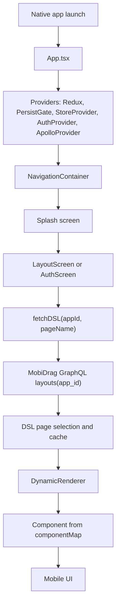
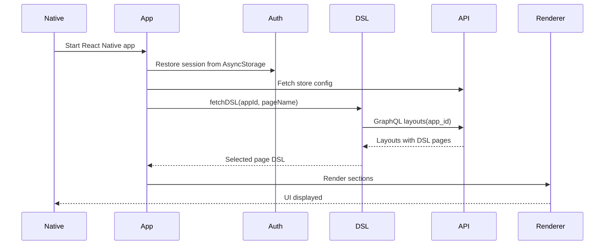
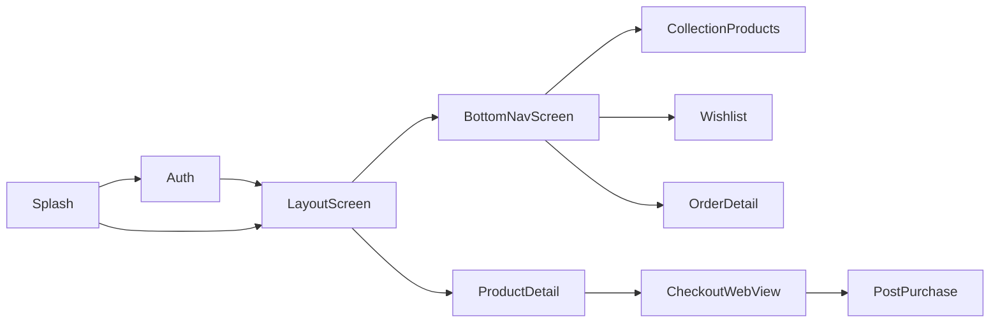
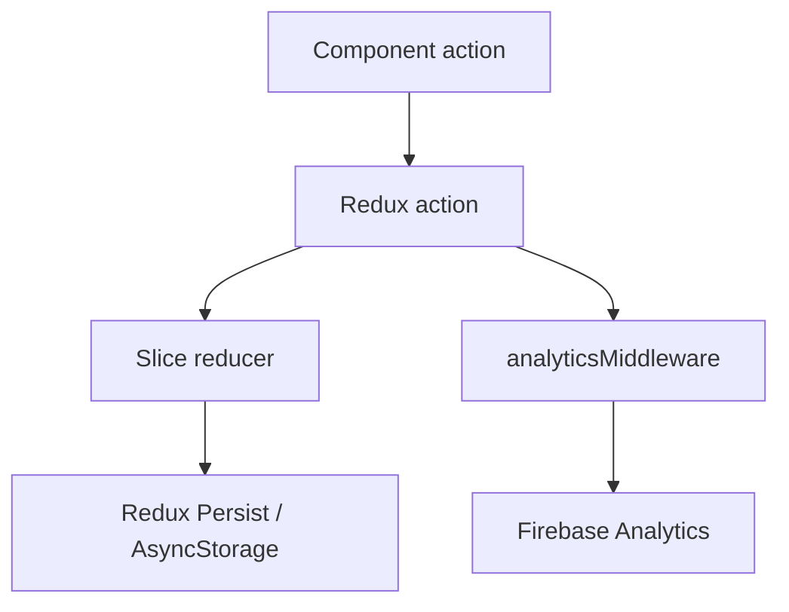

# MobiDrag Mobile App

MobiDrag is a React Native mobile app that renders ecommerce storefronts from Builder DSL/API data. The important idea is simple: the mobile UI should follow the Builder configuration. Page layout, component order, text, colors, spacing, visibility, images, navigation, splash assets, and branding should come from DSL/API data wherever possible.

This README is written for a new developer who has never worked on this project before.

## Table Of Contents

- [Project Overview](#project-overview)
- [Tech Stack](#tech-stack)
- [Folder Structure](#folder-structure)
- [Application Architecture](#application-architecture)
- [Complete App Launch Flow](#complete-app-launch-flow)
- [Navigation Flow](#navigation-flow)
- [Data Flow](#data-flow)
- [State Management](#state-management)
- [Screen Documentation](#screen-documentation)
- [Component Documentation](#component-documentation)
- [API Documentation](#api-documentation)
- [Important Utilities And Services](#important-utilities-and-services)
- [Configuration And Environment](#configuration-and-environment)
- [Run The Project Locally](#run-the-project-locally)
- [Common Development Workflows](#common-development-workflows)
- [Best Practices](#best-practices)
- [Assumptions And Limitations](#assumptions-and-limitations)

## Project Overview

The app is a dynamic storefront shell. It does not have one fixed UI. Instead, it:

1. Reads the current app id.
2. Fetches the matching Builder DSL from the MobiDrag GraphQL API.
3. Selects the requested page from the DSL.
4. Renders each DSL section through `DynamicRenderer`.
5. Uses Shopify/store APIs for products, collections, checkout, orders, currencies, and customer flows.
6. Uses Firebase for analytics and push notifications.

The same codebase can render different apps by changing the app identity and DSL data.

## Tech Stack

| Area | Technology |
| --- | --- |
| Mobile framework | React Native `0.82` |
| Language | JavaScript and TypeScript |
| UI | React Native components, React Navigation, vector icons, linear gradients |
| Navigation | `@react-navigation/native`, native stack, bottom tabs |
| API client | Apollo Client, GraphQL, `fetch` |
| State | Redux Toolkit, Redux Persist, React Context, component local state |
| Storage | AsyncStorage |
| Ecommerce | Shopify Storefront/Admin proxy through MobiDrag backend |
| Analytics | Firebase Analytics |
| Push notifications | Firebase Messaging |
| Android | Gradle, Kotlin/Java native shell |
| iOS | Xcode project, CocoaPods |

## Folder Structure

```text
.
|-- android/                  Android native project and generated Android assets
|-- ios/                      iOS native project and generated iOS assets
|-- config/                   Shared app identity config
|-- docs/                     Project docs, KT docs, analytics API notes
|-- patches/                  patch-package patches
|-- public/                   Static/public assets when needed
|-- scripts/                  Build, app identity, package, icon, and branding scripts
|-- src/
|   |-- apollo/               Apollo GraphQL client
|   |-- assets/               Static JS-side assets
|   |-- components/           Reusable DSL-rendered UI blocks
|   |-- data/                 Fallback DSL/config data
|   |-- engine/               DSL fetch, page selection, visibility, renderer
|   |-- generated/            Generated brand asset fallback data
|   |-- graphql/              GraphQL queries and mutations
|   |-- screens/              Navigation screens
|   |-- services/             API/business services and React contexts
|   |-- store/                Redux store, reducers, slices, middleware
|   |-- utils/                Small helpers for styling, money, auth, icons, navigation
|-- App.tsx                   App root, providers, navigation, FCM setup
|-- index.js                  React Native entry point
|-- package.json              Dependencies and npm scripts
```

## Application Architecture

The app has four main layers:

1. **Native shell**
   - Android and iOS projects start the React Native app.
   - Native branding assets are generated from DSL/API where possible.

2. **App shell**
   - `App.tsx` sets up providers, navigation, analytics, FCM, Redux, Apollo, store context, and auth context.

3. **DSL engine**
   - `src/engine/dslHandler.js` fetches layouts and chooses the correct page.
   - `src/engine/DynamicRenderer.js` maps DSL component names to React Native components.

4. **Feature components/screens**
   - Screens decide what page to load.
   - Components read DSL props and render the UI.
   - Services fetch products, collections, store config, auth data, notifications, analytics, and checkout data.



## Complete App Launch Flow

1. Native Android/iOS launches the React Native bundle.
2. `index.js` registers `App`.
3. `App.tsx` creates the root provider tree:
   - `Provider` for Redux.
   - `PersistGate` for persisted cart/wishlist state.
   - `SafeAreaProvider` for safe area handling.
   - `StoreProvider` for store credentials.
   - `AuthProvider` for user session.
   - `ApolloProvider` for GraphQL requests.
   - `NavigationContainer` for routes.
4. App asks for notification permission when needed.
5. Firebase Messaging token is captured and sent to backend.
6. Analytics tracks app open and screen views.
7. Initial route is `Splash`.
8. App navigates to auth or DSL-driven app screens.
9. `LayoutScreen` or `BottomNavScreen` fetches the DSL.
10. Sections are filtered by mobile visibility.
11. Headers, side navigation, bottom navigation, and page sections render.



## Navigation Flow

Navigation is defined in `App.tsx` using a native stack navigator.

Main routes:

| Route | Screen | Purpose |
| --- | --- | --- |
| `Splash` | `saplash.js` | Startup splash/loading experience |
| `Auth` | `AuthScreen.tsx` | Sign in, sign up, forgot password |
| `LayoutScreen` | `LayoutScreen.js` | Main DSL page rendering, usually home/custom pages |
| `BottomNavScreen` | `BottomNavScreen.js` | DSL page rendering with bottom navigation context |
| `ProductDetail` | `ProductDetailScreen.js` | Product details, variants, add to cart |
| `CollectionProducts` | `CollectionProductsScreen.js` | Products inside a collection |
| `SubCollections` | `SubCollectionScreen.js` | Child collections |
| `AllProducts` | `AllProductsScreen.js` | Product listing/search-style page |
| `CheckoutWebView` | `CheckoutWebViewScreen.js` | Shopify checkout webview |
| `PostPurchase` | `PostPurchaseScreen.js` | Thank you/order confirmation |
| `OrderDetail` | `OrderDetailScreen.js` | Single order detail |
| `Wishlist` | `WishlistScreen.js` | Wishlist items |
| `Settings` | `SettingsScreen.js` | Settings/profile-related page |
| `WriteReview` | `WriteReviewScreen.js` | Review form |



Navigation targets can come from:

- Bottom navigation items.
- Header icons.
- Side navigation menu items.
- Buttons in DSL components.
- Product cards.
- Collection cards.
- Push notification taps.

Use `src/utils/navigationTarget.js` when normalizing dynamic navigation actions.

## Data Flow

### Where Data Originates

Data comes from:

- MobiDrag GraphQL API: app layouts, DSL, store config, users, notifications, FCM token registration, analytics proxy.
- Shopify Storefront/Admin proxy: products, collections, cart/checkout, customer password recovery.
- Firebase: analytics and push notification events.
- Local storage: auth session, persisted cart, persisted wishlist, cached DSL.
- Route params: selected product, collection, page name, post-login target.
- Component local state: loading, form values, selected variant, UI expansion state.

### How API Requests Are Made

There are two API styles:

1. Apollo GraphQL:

```js
client.query({
  query: LAYOUT_VERSION_QUERY,
  variables: { appId },
});
```

2. Raw `fetch`:

```js
fetch("https://app.mobidrag.com/graphql", {
  method: "POST",
  headers: { "Content-Type": "application/json" },
  body: JSON.stringify({ query, variables }),
});
```

Shopify requests usually go through:

```text
https://app.mobidrag.com/api/shopify/preview-graphql
```

This backend proxy keeps Shopify credentials server-side when possible.

### How Responses Are Processed

For DSL:

1. `layouts(app_id)` returns layout records.
2. `dslHandler.js` selects the best matching layout/page.
3. It normalizes page names and aliases.
4. It applies typography and brand kit assets.
5. It stores fresh and stale caches.
6. Screens render the selected DSL.

For Shopify/product data:

1. `storeService.js` resolves the store id from layouts.
2. `getStore(store_id)` returns Shopify credentials.
3. `shopify.js` calls the proxy or Storefront API.
4. Product/collection data is normalized for components.

For auth:

1. `AuthScreen.tsx` collects form input.
2. `AuthContext.tsx` calls `authService.ts`.
3. `authService.ts` runs login/signup/recover GraphQL or Shopify flow.
4. Session is saved to AsyncStorage.
5. Redux wishlist user and analytics user are updated.

### Where Data Is Stored

| Data | Storage |
| --- | --- |
| DSL page data | In-memory cache and AsyncStorage last-good DSL cache |
| Cart items | Redux `cart` slice, persisted through Redux Persist |
| Wishlist | Redux `wishlist` slice, persisted and scoped by user |
| Auth session | AsyncStorage through `authService.ts` |
| Store config | `StoreContext` plus service-level cache |
| Side menu state | `SideMenuContext` or screen local state |
| Page empty state | `PageEmptyStateContext` |
| Component UI values | Local React state |

### Parent To Child Data Passing

DSL components receive their source section like this:

```jsx
<DynamicRenderer section={section} />
```

`DynamicRenderer` then renders:

```jsx
<Component section={section} />
```

Most reusable components parse values from:

```text
section.props.raw.value
section.properties.props.properties
section.presentation
section.layout.css
section.visibility
section.headerdefault
```

## State Management

Redux setup:

```text
src/store/index.js
src/store/rootReducer.js
src/store/slices/cartSlice.js
src/store/slices/wishlistSlice.js
src/store/slices/jsonSlice.js
src/store/analyticsMiddleware.js
```

Reducers:

| Slice | Purpose | Persistence |
| --- | --- | --- |
| `cart` | Cart line items and discounts | `items` persisted |
| `wishlist` | Wishlist items, scoped by user | `items`, `activeUserKey`, `itemsByUser` persisted |
| `json` | Generic JSON state | Not listed as persisted |

Analytics middleware listens to cart and wishlist actions:

- `cart/addItem` -> `add_to_cart`
- `cart/removeItem` -> `remove_from_cart`
- `cart/updateQuantity` -> remove event when quantity decreases
- `wishlist/toggleWishlist` -> wishlist analytics event



## Screen Documentation

| Screen | Purpose | APIs/Services | Main Components/Data |
| --- | --- | --- | --- |
| `Splash` | Startup screen before app content | Brand kit service, cached brand assets | Splash image/background from DSL/API assets |
| `AuthScreen` | Sign in, sign up, forgot password | `fetchDSL`, `authService`, Shopify password recovery | Auth DSL sections, `DynamicRenderer`, form state |
| `LayoutScreen` | Main dynamic page renderer | `fetchDSL`, analytics service | Header, side nav, bottom nav, dynamic DSL sections |
| `BottomNavScreen` | Dynamic page renderer for bottom nav pages | `fetchDSL`, notification service, auth context | Bottom nav, protected page logic, notifications |
| `ProductDetailScreen` | Product details and add to cart | Shopify services, route product data | Product images, info, variants, ATC, related products |
| `CollectionProductsScreen` | Products for selected collection | Shopify collection/product APIs | Product grid/list, filters/sort |
| `SubCollectionScreen` | Nested collections | Shopify collection APIs | Collection cards |
| `AllProductsScreen` | All/search product listing | Shopify product/search APIs | Product list, filter/sort header |
| `CheckoutWebViewScreen` | Web checkout flow | Shopify checkout URL/order data | WebView, logged-in email prefill where supported |
| `PostPurchaseScreen` | Thank you/order completed page | Route order response, analytics purchase | Order number, summary, continue shopping |
| `OrderDetailScreen` | Single order detail | Order history service, route notification data | Order rows, status, pricing |
| `WishlistScreen` | Saved products | Redux wishlist, Shopify product data | Wishlist item cards |
| `SettingsScreen` | Settings/profile route | Auth/store services | Profile/settings UI |
| `WriteReviewScreen` | Product review entry | Review-related route data | Review form |
| `BuildStatusScreen` | Build/status helper screen | Build service | Build status UI |

## Component Documentation

Most DSL components accept:

```ts
type DslComponentProps = {
  section: object;
};
```

The component should parse all design and content from `section`.

| Component | Purpose | Common DSL/Input | Used In |
| --- | --- | --- | --- |
| `Topheader` / `HeaderDefault` | Header bar and fallback header | `headerdefault`, icon/title settings | Layout pages, detail pages |
| `Header2` | Builder header variant with search/profile layout | `header_2` section props | Home/custom DSL pages |
| `BottomNavigation` | Bottom tabs | tab items, colors, icons, active index | Main pages |
| `SideNavigation` | Drawer/side menu | menu items, drawer styling | Home/custom pages |
| `HeroBanner` | Single banner hero | image, text, button, overlay, spacing | Home/custom pages |
| `BannerSlider` | Carousel/slider banner | slides, width, visibility, dots | Home/custom pages |
| `TextBlock` | Text/title/subtitle block | typography, padding, border, background | Many DSL pages |
| `ProductGrid` | Product grid | product data, grid style, card style | Home/product pages |
| `ProductCarousel` | Horizontal product carousel | products, visible count, card style | Home/custom pages |
| `TabProductGrid` | Product grid with tabs | tab data, product list, wishlist setting | Home/custom pages |
| `CollectionImage` | Collection tiles/slider | collection items, image ratio, title visibility | Collections/home |
| `MediaGrid` | Image/media grid | media items, columns, spacing | Home/custom pages |
| `Countdown` | Countdown block | date/time, image placement, CTA | Campaign pages |
| `SocialMediaIcons` | Social links | icon list, colors, platform URLs | Footer/social sections |
| `SearchBar` | Search input | placeholder/style | Header/search pages |
| `ProductInfo` | Product title/vendor/price/review info | product and DSL styling | PDP |
| `ProductDescription` | Description accordion/block | title, text, icon, visibility | PDP |
| `VariantSelector` | Product option selector | variants/options/color/size style | PDP |
| `AddToCart` | ATC/buy now/quantity UI | button styling, visibility | PDP |
| `CartLineItems` | Cart product rows | Redux cart items and DSL row style | Cart |
| `DiscountCode` | Coupon/gift card UI | coupon settings, input/button style | Cart |
| `OrderSummary` | Cart totals/pricing | subtotal, discount, tax, total | Cart/checkout |
| `CheckoutButton` | Checkout CTA | button text/style/action | Cart |
| `AccountProfile` | Profile header/card | user profile and DSL style | Account |
| `AccountMenu` | Account menu rows | menu items/actions | Account |
| `CurrencySwitcher` | Currency selector | Shopify currencies, selected user currency | Account |
| `Logout` | Logout button/dialog | DSL text/style/message | Account |
| `NotificationList` | Notification inbox list | notifications query or DSL defaults | Notifications |
| `OrderHistory` | User order list | order history service/user session | Account/orders |
| `WishlistItem` | Wishlist card | wishlist Redux item | Wishlist/account |
| `CustomButton` | Generic action button | label, link, action style | Any DSL page |
| `SkeletonLoader` | Loading placeholder | local loading state | Screens |
| `Snackbar` | Toast/message UI | local message state | Layout screen |

When adding a new Builder component:

1. Create component in `src/components`.
2. Add import and mapping in `src/engine/DynamicRenderer.js`.
3. Read DSL values from `section`.
4. Avoid hardcoded styling unless it is a safe fallback.
5. Test with actual DSL payload.

## API Documentation

### Base MobiDrag GraphQL API

```text
https://app.mobidrag.com/graphql
```

Apollo client:

```text
src/apollo/client.js
```

### Layouts Query

File:

```text
src/graphql/queries/layoutVersionQuery.js
```

Request:

```graphql
query Layouts($appId: Int) {
  layouts(app_id: $appId) {
    app_id
    store_id
    page_name
    handle
    layout_versions {
      dsl
      version_number
      store_id
      app_id
    }
  }
}
```

Used by:

- `dslHandler.js`
- `layoutService.js`
- `storeService.js` for resolving store id

Error handling:

- Request timeout in `dslHandler.js`.
- Fresh/stale in-memory cache.
- Persisted last-good DSL cache in AsyncStorage.
- Empty/error UI in screens.

### Store Config

File:

```text
src/services/storeService.js
```

Steps:

1. Query `layouts(app_id)` to resolve `store_id`.
2. Query `getStore(store_id)` to get Shopify config.

Response includes:

```text
id, user_id, shopify_domain, access_token, storefront_access_token,
shop_name, shop_owner, currency, timezone, country, plan_name, status
```

### Shopify Product And Checkout Data

File:

```text
src/services/shopify.js
```

Preferred proxy:

```text
https://app.mobidrag.com/api/shopify/preview-graphql
```

Common data:

- Recent products.
- Collections.
- Product details.
- Collection products.
- Trending searches.
- Customer password recovery.
- Checkout/order data.

Error handling:

- Request cache and in-flight dedupe.
- Storefront auth failure detection.
- Proxy first, fallback direct Storefront call where supported.
- Empty product lists are usually not cached to avoid locking transient failures.

### Auth APIs

Files:

```text
src/services/authService.ts
src/services/customerService.js
src/graphql/mutations/loginUserMutation.ts
src/graphql/mutations/createUserMutation.ts
src/graphql/mutations/loginCustomerMutation.js
src/graphql/mutations/registerCustomerMutation.js
```

Flows:

- Login user by email/password.
- Register user/customer.
- Create Shopify customer access token when needed.
- Recover Shopify customer password.
- Save session in AsyncStorage.

### Notifications

Files:

```text
src/graphql/queries/getNotificationsQuery.js
src/graphql/mutations/createFcmTokenMutation.js
src/graphql/mutations/updateFcmTokenMutation.js
src/graphql/mutations/sendOrderNotificationMutation.js
src/services/notificationFetchService.js
src/services/fcmTokenService.js
src/utils/tokenLogger.js
```

Queries/mutations:

- `notifications(app_id, user_id)`
- `createFcmToken(token, userid, appid)`
- `updateFcmToken(id, userid, token, appid)`
- `createNotification(...)`

Notification tap behavior is handled in `App.tsx`.

### Currency

Files:

```text
src/graphql/queries/getShopifyCurrenciesQuery.js
src/services/currencyService.js
src/components/CurrencySwitcher.js
```

Query:

```graphql
query GetCurrencies($shop: String!, $accessToken: String!) {
  getShopifyCurrencies(shop: $shop, accessToken: $accessToken) {
    success
    currencies
  }
}
```

### Analytics

Files:

```text
src/services/analyticsService.js
src/services/builderAnalyticsService.js
src/graphql/queries/runBigQueryQuery.js
src/store/analyticsMiddleware.js
docs/analytics-builder-api.md
```

Tracked examples:

- `app_open`
- `screen_view`
- `login`
- `sign_up`
- `logout`
- `view_item`
- `add_to_cart`
- `remove_from_cart`
- `add_to_wishlist`
- `remove_from_wishlist`
- `begin_checkout`
- `purchase`

Builder analytics query uses `runBigQueryQuery` and filters by `app_id` and optionally `store_id`.

## Important Utilities And Services

| File | Purpose |
| --- | --- |
| `src/utils/appId.js` | Resolves app id from env/config/fallback |
| `src/utils/appInfo.js` | Reads app name/logo display info |
| `src/utils/navigationTarget.js` | Normalizes dynamic navigation targets |
| `src/utils/normalizeDSL.js` | DSL normalization helpers |
| `src/utils/convertStyles.js` | Converts DSL style values to React Native styles |
| `src/utils/sectionSpacing.js` | Section margin/spacing helpers |
| `src/utils/productImageFit.js` | Image resize/fit behavior |
| `src/utils/money.js` | Money parsing, currency symbols, formatting |
| `src/utils/cartDiscounts.js` | Discount code normalization |
| `src/utils/authGate.js` | Auth/protected route checks |
| `src/services/brandKitService.js` | Runtime brand assets from DSL |
| `src/services/typographyService.js` | Runtime typography/font helpers |
| `src/services/headerDefaultService.js` | Shared header default config |
| `src/services/searchHistoryService.js` | Search history |
| `src/services/orderHistoryService.js` | User orders |

## Configuration And Environment

### App Identity

Single source:

```text
config/appIdentity.json
```

Current format:

```json
{
  "appId": 187,
  "name": "MobiDrag",
  "displayName": "SWADESHI"
}
```

Rules:

- Change `appId` when switching Builder app.
- Change `displayName` for installed app name.
- Keep `name` as `MobiDrag` unless the native React Native module is intentionally renamed.

Run after changes:

```sh
npm run sync:app-identity
```

### Environment Variables

| Variable | Purpose |
| --- | --- |
| `APP_ID` | Overrides app id for scripts/runtime where used |
| `REACT_APP_APP_ID` | Alternate app id override |
| `APP_NAME` | Used by package/config scripts |
| `PACKAGE_NAME` | Optional native package id override in package scripts |

### Branding Scripts

| Script | Purpose |
| --- | --- |
| `scripts/sync-app-identity.js` | Sync app id/name into legacy/native files |
| `scripts/update-app-icon.js` | Fetch Android brand assets and generate icon/splash resources |
| `scripts/update-ios-brand-assets.js` | Fetch iOS brand assets |
| `scripts/update-package-config.js` | Update Android/iOS package/app name config |
| `scripts/fix-react-native-entry-point.js` | Repair generated RN native entry point if package references drift |

## Run The Project Locally

### Requirements

- Node.js 20 or newer.
- npm.
- Android Studio and Android SDK for Android.
- Xcode and CocoaPods for iOS.
- Java/JDK compatible with the Android Gradle setup.

### Install

```sh
npm install
```

### Start Metro

```sh
npm start
```

### Run Android

```sh
npm run android
```

### Run iOS

```sh
npm run ios
```

### iOS Pods

Run after native dependency changes:

```sh
bundle install
cd ios
bundle exec pod install
cd ..
```

## Common Development Workflows

### Change App ID Or Display Name

```sh
# edit config/appIdentity.json first
npm run sync:app-identity
```

Then rebuild the app.

### Refresh Android Brand Assets

```sh
node scripts/update-app-icon.js
cd android
.\gradlew.bat clean assembleDebug
```

### Build Android Debug APK

```sh
cd android
.\gradlew.bat clean assembleDebug
```

Output:

```text
android/app/build/outputs/apk/debug/app-debug.apk
```

### Refresh Packaged Android JS Bundle

Run this after JS renderer/component changes if the packaged APK uses bundled JS:

```sh
npx react-native bundle --platform android --dev false --entry-file index.js --bundle-output android/app/src/main/assets/index.android.bundle --assets-dest android/app/src/main/res
```

### Refresh Packaged iOS JS Bundle

```sh
npx react-native bundle --platform ios --dev false --entry-file index.js --bundle-output ios/main.jsbundle --assets-dest ios
```

### Stop Stuck Gradle Daemons

```sh
cd android
.\gradlew.bat --stop
```

### Debug Firebase Analytics On Android

```sh
npm run android:analytics-debug
```

### Pre-commit Checks

```sh
git status --short
git diff --check
npm run check:no-patch-artifacts
```

## Best Practices

1. Treat DSL as the source of truth.
2. Do not hardcode UI values if DSL provides them.
3. Keep fallbacks minimal and safe.
4. Add new DSL components to `DynamicRenderer.js`.
5. Keep component props backward-compatible because builder payloads may vary.
6. Use shared utilities for money, navigation, image fit, spacing, icons, and typography.
7. Cache data carefully, but do not cache transient empty/error responses as permanent UI.
8. Scope user data by app/store/user where possible.
9. After JS renderer changes, refresh bundled JS when building APKs.
10. After native icon/splash/package changes, clean rebuild and reinstall.
11. Avoid editing unrelated files in a dirty working tree.

## Assumptions And Limitations

- The app depends on live MobiDrag APIs and Shopify/store credentials.
- Some fallbacks exist for missing DSL, missing store config, or auth screens, but final UI should be DSL-driven.
- Native app icon/splash/notification resources are generated during build time, so a rebuild/reinstall is required to see native resource changes.
- Old notifications already visible in Android notification shade will not change after icon fixes. Send a new notification after reinstall.
- Analytics requires Firebase configuration and correct app/store id parameters.
- Builder payload shapes can change, so parsers should support aliases and optional fields.
- This README documents the current structure of the project. If major files are renamed or flows are rewritten, update this README in the same change.

## Extra Docs

- `docs/DEVELOPER_KT.md` - simple KT/handover guide.
- `docs/analytics-builder-api.md` - Builder analytics API notes.
- `PACKAGE_CONFIG.md` - package/app configuration notes.
- `scripts/README.md` - script-specific documentation.
